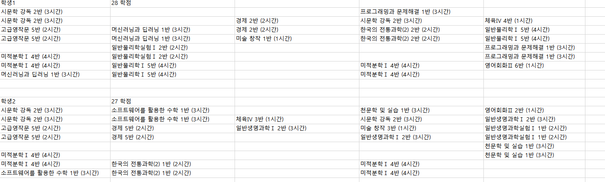
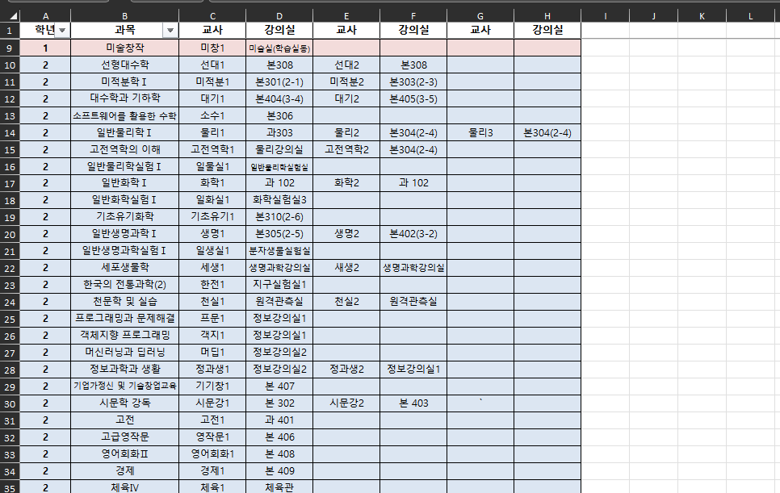
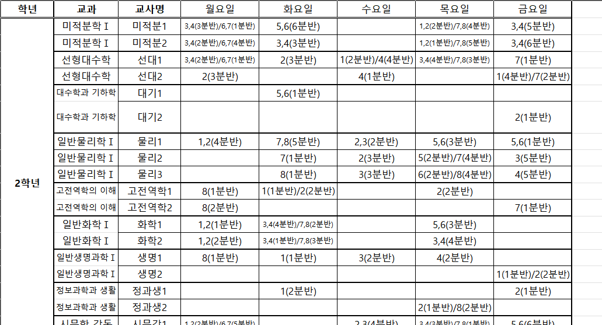
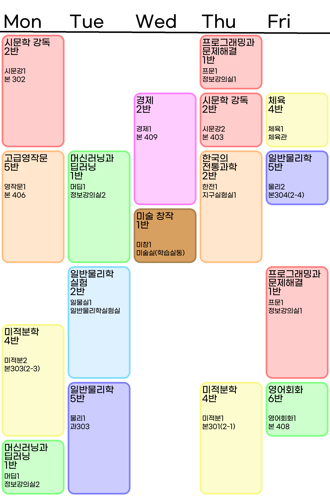
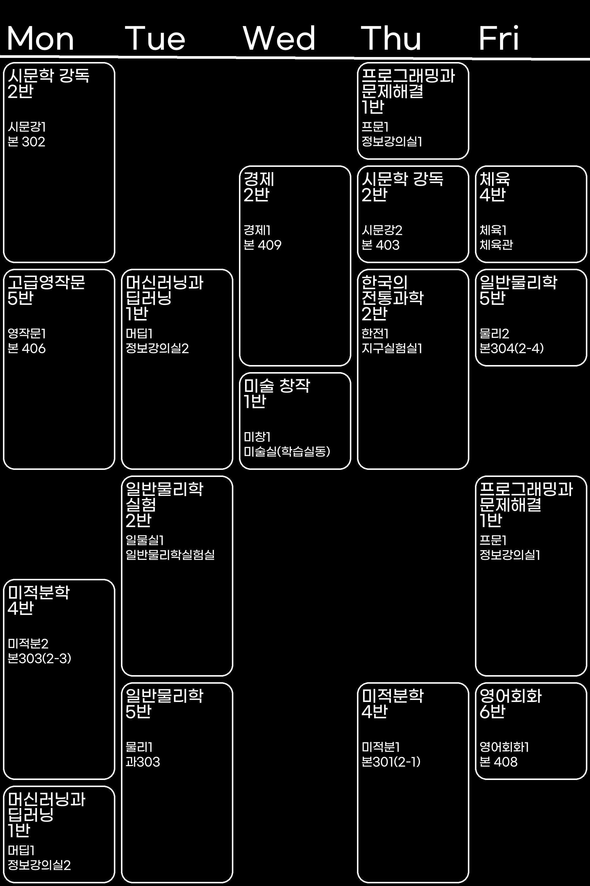

# TimeTableImager

광주과학고등학교 학생들은 2학년 2학기부터 각자가 원하는 과목을 선택하여 듣습니다. 때문에 개개인의 시간표가 모두 다르게 됩니다.

학교에서 학생들에게 시간표를 공지할 때 아래 사진과 같은 엑셀 파일로 공지합니다.



또한, 수업에 들어오는 선생님이 두분 이상일 경우에는 아래 사진과 같이 장소와 들어오시는 선생님을 공지합니다.





학생들은 자신의 시간표를 확인하기 위해 각자 어플을 활용하여 시간표를 제작하여 휴대폰 바탕화면으로 설정하여 사용합니다.
그러나 **개인이 직접 만들기에는 너무나 성가신 일입니다** 그래서 이 프로그램을 만들게 되었습니다.

이 프로그램은 학교에서 공지하는 엑셀 파일을 읽어서 각자의 시간표를 이미지로 만들어주는 프로그램입니다.

## 결과물

### 기본 모드



### 다크 모드



## 코드 설명

프로그램은 개인별 시간표 엑셀 파일 읽기 => 추가정보(선생님, 강의실 정보 확인) => 이미지 제작 순으로 이루어집니다.

### 엑셀 파일 읽기

엑셀 파일을 읽을때는 template.txt 파일이 필요합니다.

```txt
name
mon_1, tue_1, wed_1, thu_1, fri_1
mon_2, tue_2, wed_2, thu_2, fri_2
mon_3, tue_3, wed_3, thu_3, fri_3
mon_4, tue_4, wed_4, thu_4, fri_4
mon_5, tue_5, wed_5, thu_5, fri_5
mon_6, tue_6, wed_6, thu_6, fri_6
mon_7, tue_7, wed_7, thu_7, fri_7
mon_8, tue_8, wed_8, thu_8, fri_8
mon_9, tue_9, wed_9, thu_9, fri_9
,,,,
```

와 같이 csv 형식과 유사하게 작성하며 mon_1 ~ fri_9가 각 과목의 위치에 들어가도록 설정하면 됩니다.

### 추가정보 확인

여긴 저희 학교 엑셀 파일 구조에만 특정하여 처리하는 부분이기에 다른 학교에서 사용하시거나 다른 방식으로 엑셀 파일을 만드신다면 수정이 필요합니다.

### 이미지 제작

pillow 라이브러리를 사용하여 이미지를 제작합니다.

## 기타

질문이나 문의사항은 이슈에 남겨주시면 됩니다.