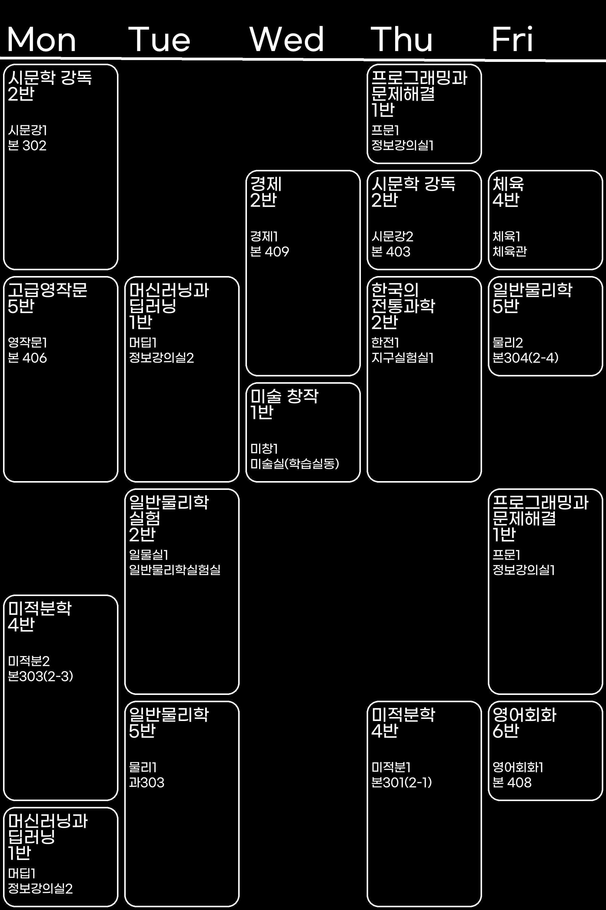

# TimeTableImager
엑셀파일로 제공되는 시간표를 이미지로 일괄 변환해주는 코드

아직 광주과학고 엑셀 양식에만 최적화되어 있음.

다른 학교에서 사용하기 위해 코드를 조금 ~~많이~~ 수정해야 할수도 있음.

**이슈(확인이 빠를 확률이 높음)** 나 이메일(seolchaehwan@naver.com)으로 알려주면 도와드리겠습니다.

## 예시

